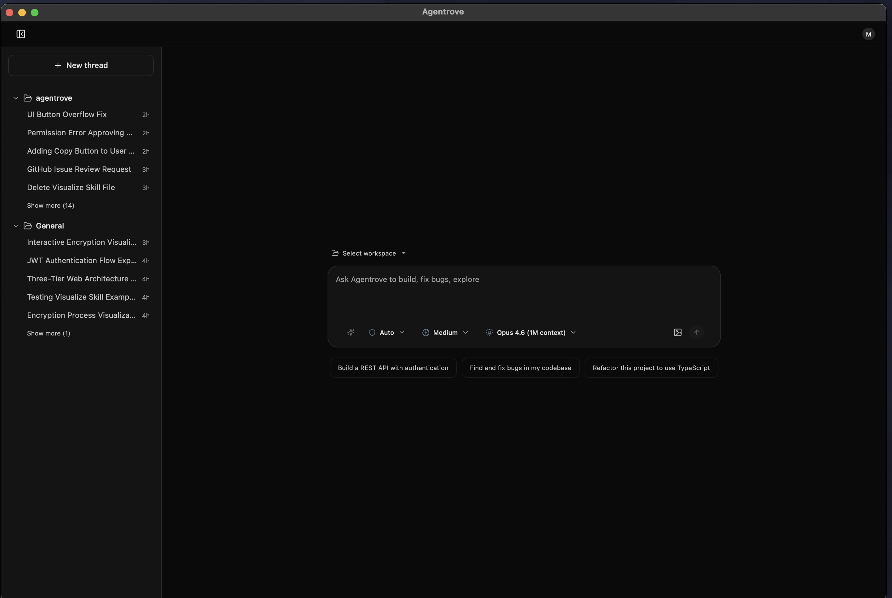
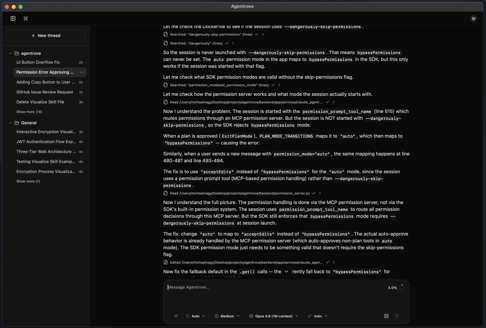

# Agentrove

Self-hosted AI coding workspace with Claude and Codex agents, isolated sandboxes, and a full web IDE.

[](https://www.apache.org/licenses/LICENSE-2.0)
[](https://www.python.org/)
[](https://reactjs.org/)
[](https://fastapi.tiangolo.com/)
[](https://discord.gg/HvkJU8dcBA)

> **Note:** Agentrove is under active development. Expect breaking changes between releases.

## Screenshots




## Community

Join the [Discord server](https://discord.gg/HvkJU8dcBA).

## Why Agentrove

- Run Claude Code and Codex from one self-hosted interface
- Keep each project in its own Docker or host sandbox
- Work in chat, editor, terminal, diff, secrets, and PR review views side by side
- Reuse the same workspace context across chats and sub-threads
- Manage MCP servers, agents, skills, commands, personas, env vars, and marketplace plugins from the app

## Core Architecture

```text
React/Vite Frontend
  -> FastAPI Backend
  -> PostgreSQL + Redis (web mode)
  -> SQLite + in-memory cache/pubsub (desktop mode)
  -> Workspace sandbox (Docker or Host)
  -> Claude Code ACP / Codex ACP
  -> Claude Code CLI / Codex CLI
```

The app can launch either:

- **Claude** via `claude-agent-acp` + Claude Code
- **Codex** via `codex-acp` + Codex CLI

## Key Features

- Claude and Codex model selection in the same UI
- Agent-specific permission modes and reasoning/thinking modes
- Workspace-based project organization with per-workspace sandboxes
- Docker and host sandbox providers
- Built-in editor, terminal, diff, secrets, and PR review panels
- Git helpers for branches, commits, push/pull, and PR creation
- Streaming chat sessions with resumable SSE events and explicit cancellation
- Sub-threads for branching work from an existing chat
- Extension management for MCP servers, custom agents, skills, slash commands, personas, env vars, and marketplace plugins
- Web app and macOS desktop app

## Workspaces

Workspaces are the top-level project unit. Each workspace owns a sandbox and groups related chats under one project context.

### Source types

- **Empty**: create a new empty directory
- **Git clone**: clone a repository into a fresh sandbox
- **Local folder**: mount an existing host directory when using the host sandbox

### Sandbox isolation

Each workspace gets its own sandbox instance. Chats in the same workspace share the same filesystem, installed tools, auth files, and `.claude` / `.codex` resources.

### Per-workspace sandbox provider

You can choose a sandbox provider per workspace:

- **Docker**: isolated local container
- **Host**: runs directly on the host machine

## Models And Agents

The app currently exposes two agent families:

- **Claude**: `default`, `opus`, `haiku`
- **Codex**: `gpt-5.4`, `gpt-5.4-mini`, `gpt-5.3-codex`, `gpt-5.2-codex`, `gpt-5.2`, `gpt-5.1-codex-max`, `gpt-5.1-codex-mini`

Agent-specific controls:

- **Claude permission modes**: `default`, `acceptEdits`, `plan`, `bypassPermissions`
- **Codex permission modes**: `default`, `read-only`, `full-access`
- **Claude thinking modes**: `low`, `medium`, `high`, `max`
- **Codex reasoning modes**: `low`, `medium`, `high`, `xhigh`

## Settings Surface

Current settings are organized around:

- General account settings
- Marketplace plugins
- MCP servers
- Custom agents
- Skills
- Slash commands
- Personas
- Environment variables
- Custom instructions

General settings also include:

- GitHub personal access token
- Default sandbox provider
- Timezone
- Notification preferences
- Auto-compact toggle
- Attribution toggle

## Quick Start (Web)

### Requirements

- Docker
- Docker Compose

### Start

```bash
git clone https://github.com/Mng-dev-ai/agentrove.git
cd agentrove
cp .env.example .env
```

Set a `SECRET_KEY` in `.env`:

```bash
openssl rand -hex 32
```

Start the stack:

```bash
docker compose -p agentrove-web -f docker-compose.yml up -d
```

Open [http://localhost:3000](http://localhost:3000).

### Stop and logs

```bash
docker compose -p agentrove-web -f docker-compose.yml down
docker compose -p agentrove-web -f docker-compose.yml logs -f
```

## Desktop (macOS)

Desktop mode uses Tauri with a bundled Python backend sidecar on `localhost:8081` and local SQLite storage.

### Download prebuilt app

- Apple Silicon DMG: [Latest Release](https://github.com/Mng-dev-ai/agentrove/releases/latest)

### How it works

```text
Tauri Desktop App
  -> React frontend
  -> bundled backend sidecar (localhost:8081)
  -> local SQLite database
  -> local workspace sandbox access
```

### Build and run from source

Requirements:

- Node.js
- Rust

Dev workflow:

```bash
cd frontend
npm install
npm run desktop:dev
```

Build:

```bash
cd frontend
npm run desktop:build
```

App bundle output:

- `frontend/src-tauri/target/release/bundle/macos/Agentrove.app`

## Included Tooling

The backend and sandbox images install the tooling Agentrove needs to run coding agents locally, including:

- Claude Code
- Codex CLI
- `claude-agent-acp`
- `codex-acp`
- GitHub CLI
- Playwright MCP

Agentrove also syncs local Claude and Codex auth/config files into sandboxes when available.

## Services and Ports (Web)

- Frontend: `3000`
- Backend API: `8080`
- PostgreSQL: `5432`
- Redis: `6379`

## API and Admin

- API docs: [http://localhost:8080/api/v1/docs](http://localhost:8080/api/v1/docs)
- Admin panel: [http://localhost:8080/admin](http://localhost:8080/admin)

## Health and Ops

- Liveness endpoint: `GET /health`
- Readiness endpoint: `GET /api/v1/readyz`
  - web mode checks database and Redis
  - desktop mode checks database only

## Deployment

- VPS/Coolify guide: [docs/coolify-installation-guide.md](docs/coolify-installation-guide.md)
- Production setup serves frontend at `/` and API under `/api/*`

## Tech Stack

- Frontend: React 19, TypeScript, Vite, TailwindCSS, Zustand, React Query, Monaco, xterm.js
- Backend: FastAPI, SQLAlchemy, Redis, PostgreSQL/SQLite
- Runtime: Claude Code, Codex CLI, ACP, Docker, Tauri

## License

Apache 2.0. See [LICENSE](LICENSE).

## Contributing

Contributions are welcome. Open an issue first to discuss the change, then submit a pull request.
